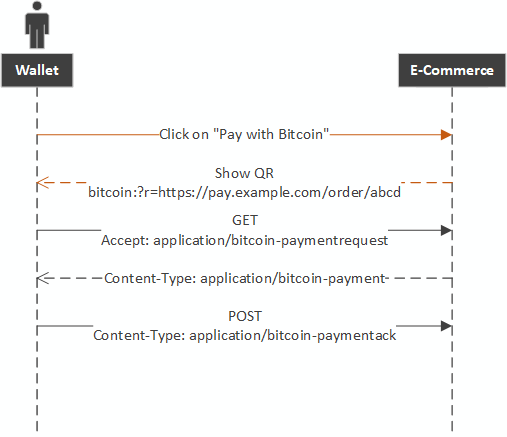
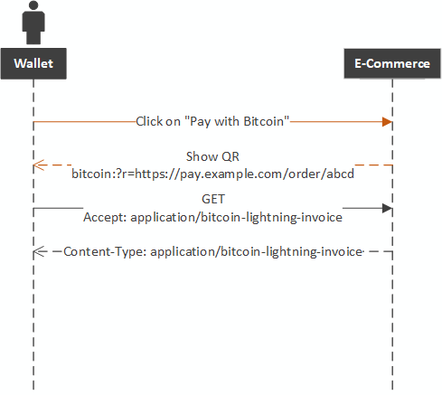

# BOLT #xx: Unified Lightning Network Invoice

Defining structure and MIME type for Lightning Network Invoice containing BOLT-11 payload. This will help reduce size of data included in QR codes, maintain backwards compatibility and leverage existing `bitcoin:` URI scheme.

## Motivation

The primary motivation is unifying `bitcoin:` URI schemes for both on-chain and off-chain payments. Additional benefits are shorter URIs and less data to encode in QR codes. Standardization of MIME type and invoice structure will streamline implementation in Lightning Network wallets.

## Specification

The Media Type (Content-Type in HTML/email headers) shall be:

Message | Type/Subtype
--------|---------------
Lightning Network Invoice | application/bitcoin-lightning-invoice

Clients can use this MIME to signal acceptance by setting `Accept: application/bitcoin-lightning-invoice` Header in HTTP request. If Server is responding with Invoice containing BOLT-11 payload it will set `Content-Type: application/bitcoin-lightning-invoice` Header in HTTP response.

We are opting out for compact structure of Invoice with newline as separator of information in body of HTTP response. Each line will have predefined function:

<pre>
[BOLT-11 payload]
[Lightning Network peer information, optional]
[Lightning Network peer alias, optional]
</pre>

## Implementation

Standard `bitcoin:address?amount=0.1` payment requests can be extended with optional `r=ENCODED_URL` per [BIP-72](https://github.com/bitcoin/bips/blob/master/bip-0072.mediawiki). Compatible Lightning Network wallets would parse this query parameter and, if present, send request to extracted URL.

If response sent by web server is `application/bitcoin-lightning-invoice` MIME type, wallet would proceed with decoding the data per [BOLT-11 Invoice Protocol](https://github.com/lightningnetwork/lightning-rfc/blob/master/11-payment-encoding.md). If payment can't be routed through existing LN channels user has open, wallet should offer to open the channel using embedded peer information.

## Example

If the user has an bitcoin wallet, the user experience is exactly as [BIP70](https://github.com/bitcoin/bips/blob/master/bip-0070.mediawiki) is specified.

On the other hand, if the user has a lightning wallet, while the same QR Code is presented, the wallet requests differently.

Payment Server generates invoice for 0.020 BTC to be sent over Lightning Network with fallback to 3EktnHQD7RiAE6uzMj2ZifT9YgRrkSgzQX. Instead of embedding [BOLT 11](https://github.com/lightningnetwork/lightning-rfc/blob/master/11-payment-encoding.md#on-mainnet-with-fallback-p2sh-address-3ektnhqd7riae6uzmj2zift9ygrrksgzqx), Payment Server generates following payment URI: `bitcoin:?r=https://pay.example.com/order/abcd`

Lightning Network wallet's would issue HTTP GET request to `bitcoin:?r=https://pay.example.com/order/abcd` with `Accept: application/bitcoin-lightning-invoice` HTTP header. 

If the server supports lightning payment, it responds with the following data:

<pre>
Content-Type: application/bitcoin-lightning-invoice

lnbc20m1pvjluezhp58yjmdan79s6qqdhdzgynm4zwqd5d7xmw5fk98klysy043l2ahrqspp5qqqsyqcyq5rqwzqfqqqsyqcyq5rqwzqfqqqsyqcyq5rqwzqfqypqfppj3a24vwu6r8ejrss3axul8rxldph2q7z9kmrgvr7xlaqm47apw3d48zm203kzcq357a4ls9al2ea73r8jcceyjtya6fu5wzzpe50zrge6ulk4nvjcpxlekvmxl6qcs9j3tz0469gq5g658y
039ae2ef0c151e1e9032521002893dee94a5751c827e4941b5167f9d655a997c6f@34.200.252.146
Y'alls
</pre>

This invoice would be parsed as:

 - BOLT-11 payload: `lnbc20m1pvj...`
 - LN Peer info: `039ae2ef0...`
 - Optional alias for LN Peer info to use in Wallet Contacts: `Y'alls`
 
 ## References
 
  - [BOLT-11](https://github.com/lightningnetwork/lightning-rfc/blob/master/11-payment-encoding.md)
  
 ## Authors
 
  - Predrag Tomasevic &lt;codeoverwhelming@outlook.com&gt;
  - Nicolas Dorier &lt;nicolas.dorier@gmail.com&gt;
 
